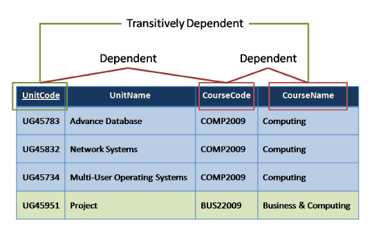

# Normalization in dbms

### Why normalization

---

Normalization is a process of organizing the data in database to avoid data redundancy. Redundancy mean duplication of same data in dbms.

---

### Anomalies in DBMS

---

Anomally is an undesirable consequesnce of data modification in which two or more different themes are entered (insertion anamoly) in a single row or two or more themes are lost if the row is deleted (deletino anaomaly)

There are three types of anomalies that occur when the database is not normalized.These are Insertion, update and deletion anomaly. To overcome these anomalies we need to normalize the data.

Here are the most commonly used normal forms:

---

##### First normal form(1NF)
##### Second normal form(2NF)
##### Third normal form(3NF)
##### Boyce & Codd normal form (BCNF)

---

### First normal form (1NF) --->  Atomicity 

Column (attribute) of a table cannot hold multiple values. ( should be atomic )

##### example 

|Customer table |
|---------------| 

| customer_id        | firstname           | surname  | tp
| ------------- |:-------------:| :-----:| :-------:     
| 123     | Pooja |  Singh | 555-861-2025, 192-122-1111              
| 234      | San      |   Zhang | (555) 403-1659 Ext. 53; 182-929-2929
| 456 |  John      |   Doe |  555-808-963

Note that tp column contain more than one number for one customer.
So apparent solution can be adding more columns.

| customer_id        | firstname           | surname  | tp | tp2
| ------------- |:-------------:| :-----:| :-------:  | :---: 
|  
| 123     | Pooja |  Singh | 555-861-202 | 192-122-1111              
| 234      | San      |   Zhang | (555) 403-1659 | Ext. 53; 182-929-2929| 
| 456 |  John      |   Doe |  555-808-963

Technically, this table does not violate the requirement for values to be atomic. However, informally, the two telephone number columns still form a `repeating group`  they repeat what is conceptually the same `attribute`, namely a telephone number. An arbitrary and hence meaningless ordering has been introduced

To bring the model into the first normal form, we split the strings we used to hold our telephone number information into "atomic" entities: single phone numbers. And we ensure no row contains more than one phone number.

| customer_id        | firstname           | surname  | tp
| ------------- |:-------------:| :-----:| :-------:     
| 123     | Pooja |  Singh | 555-861-2025, 192-122-1111   
| 123     | Pooja |  Singh | 192-122-1111               
| 234      | San      |   Zhang | (555) 403-1659 Ext. 53 1
| 234      | San      |   Zhang | 82-929-29291
| 456 |  John      |   Doe |  555-808-963

Note that the "ID" is no longer unique in this solution with duplicated customers. To uniquely identify a row, we need to use a combination of (ID, Telephone Number). The value of the combination is unique although each column separately contains repeated values. Being able to uniquely identify a row (tuple) is a requirement of 1NF.

An altrnate design is make two tables 

|customer table |
:-

| customer_id        | firstname           | surname  
| ------------- |:-------------:| :-----:   
| 123     | Pooja |  Singh               
| 234      | San      |   Zhang 
| 456 |  John      |   Doe |

| customer tp number table |
:-

| id        | customer_id           | tp
| ------------- |:-------------:| :-----:|
| 123     | 1| 555-861-2025, 192-122-1111              
| 234      | 2     | (555) 403-1659 Ext. 53; 182-929-2929
| 456 |  3   |  555-808-963

### Second normal form (2NF) 

##### To qualify for second normal a relation must meet first normal form.

##### A relation is in 2NF if it is in 1NF and no `non-prime attribute` is dependent on any proper subset of any `candidate key` of the relation (partial dependent)

An attribute that is not part of any candidate key is known as `non-prime attribute.`

Multiple candidate keys occur in the following relation:

| Manufacturer        | model           | Model Full Name  | Manufacturer Country
| ------------- |:-------------:| :-----:| :-------:     
| Forte	     | X-Prime |  Forte X-Prime | Italy
| Forte     | Ultraclean  |  Forte Ultraclean | Italy               
| Dent-o-Fresh	      | EZbrush      |   Dent-o-Fresh EZbrush | USA
| Kobayashi      | ST-60     |   Kobayashi ST-60| Japan
| Hoch |  Toothmaster      |   Hoch Toothmaster |  Germany  
| Hoch |  X-prime      |   Hoch X-Prime |  Germany 

Even if the designer has specified the primary key as {Model Full Name}, the relation is not in 2NF because of the other candidate keys. {Manufacturer, Model} is also a candidate key, and `Manufacturer Country` is dependent on a proper subset of it: `Manufacturer`. To make the design conform to 2NF, it is necessary to have two relations.

Electric Toothbrush Manufacturers

| Manufacturer | Manufacturer Country
|:------:| :----:|
| Forte|  Italy |
|Dent-o-Fresh| USA|
|  Kobayashi | Japan | 
|Hoch | Germany | 

Electric Toothbrush Models

| Manufacturer        | model           | Model Full Name  
| ------------- |:-------------:| :-----:
| Forte	     | X-Prime |  Forte X-Prime 
| Forte     | Ultraclean  |  Forte Ultraclean
| Dent-o-Fresh	      | EZbrush      |   Dent-o-Fresh EZbrush |
| Kobayashi      | ST-60     |   Kobayashi ST-60
| Hoch |  Toothmaster      |   Hoch Toothmaster
| Hoch |  X-prime      |   Hoch X-Prime 

## Third normal form (3NF)

Third normal form (3NF) is a normal form that is used in normalizing a database design to reduce the duplication of data and ensure `referential integrity` by ensuring that

     
1) The entity is in second normal form    

    
2) All the attributes in a table are determined only by the candidate keys of that relation and not by any non-prime attributes. 
 (Every non-prime attribute of R relationis `non-transitively dependent` on every key of R. )

 ##### transitively dependant 

An example of a 2NF table that fails to meet the requirements of 3NF is:

|Tournament Winners|
|:---:| 

| Tournament | Year | Winner | Winner Date of Birth | 
|:----:| :---:| :---: | :---:
| Indiana Invitational|  1998 | 	Al Fredrickson| 21 July 1975
| Cleveland Open | 1999 |  Bob Albertson |  28 September 1968|| Des Moines Masters | 1999 | Al Fredrickson | 21 July 1975| 
| Indiana Invitational |  1999 | Chip Masterson	 | 	14 March 1977 |
| Des Moines Masters |  1999	 | Al Fredrickson | 21 July 1975 | 

The breach of 3NF occurs because the non-prime attribute Winner Date of Birth is transitively dependent on the candidate key {Tournament, Year} via the non-prime attribute Winner. The fact that Winner Date of Birth is functionally dependent on Winner makes the table vulnerable to `logical inconsistencies`, as there is nothing to stop the same person from being shown with different dates of birth on different records.

In order to express the same facts without violating 3NF, it 
is necessary to split the table into two: 

Tournament Winners 

| Tournament | Year | Winner 
|:----:| :---:| :---: 
| Indiana Invitational|  1998 | 	Al Fredrickson21 July 1975
| Cleveland Open | 1999 |  Bob Albertson 
| Indiana Invitational |  1999 | Chip Masterson	 
| Des Moines Masters |  1999	 | Al Fredrickson 

Winner Dates of Birth 

| Winner | Date of Birth | 
|:---: | :----: | 
| Chip Masterson | 14 March 1977 | 
| Al Fredrickson | 	21 July 1975 | 
| Bob Albertson | 	28 September 1968 | 

Update anomalies cannot occur in these tables, because unlike before, Winner is now a primary key in the second table, thus allowing only one value for Date of Birth for each Winner.

 